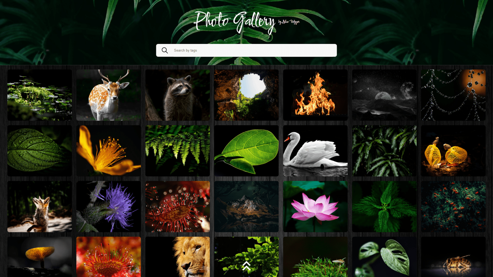
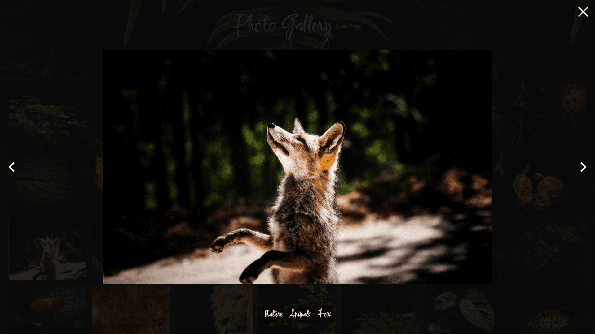
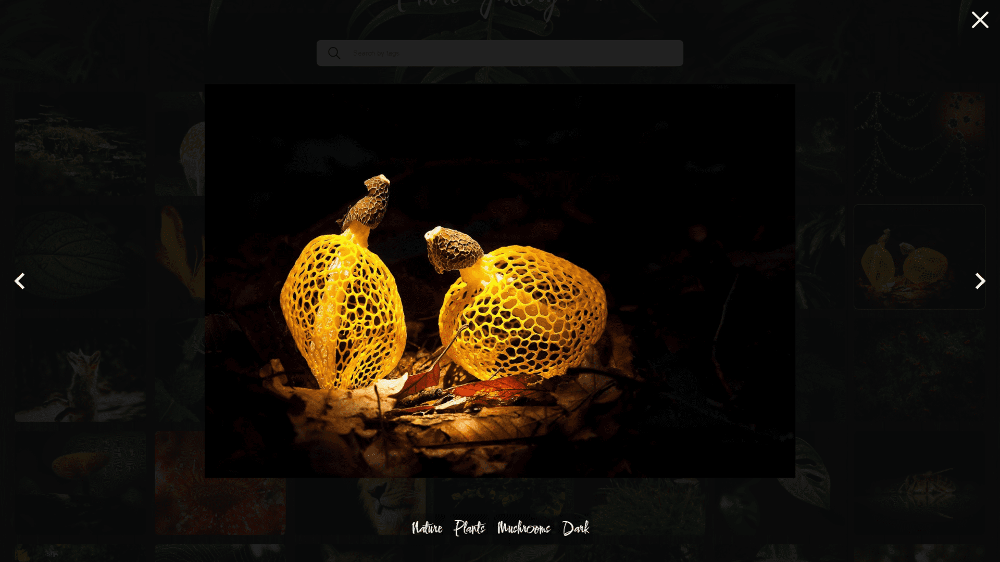

# Photo Gallery
This is a learning project from the Frontend Web Development course of the [Developer Akademie](https://developerakademie.com).

**<u>IMPORTANT:</u>** Please note that learning projects focus on the given tasks. It is therefore possible that some functions do not work or are not scripted.

**Table of Contents**

- [Photo Gallery](#photo-gallery)
  - [Features](#features)
  - [Preview](#preview)
  - [Run the Application](#run-the-application)
    - [1. Requirements](#1-requirements)
    - [2. Clone the Source](#2-clone-the-source)
    - [3. Start the Application](#3-start-the-application)
  - [Feedback \& Support](#feedback--support)
  - [License](#license)
    - [Graphics](#graphics)
    - [Source Code](#source-code)

## Features
Here is an overview of the most important functions of the project.

**Available Languages**

- German

**Functionality**

- Navigating through images is possible
- More images can be added to the array `images` in script.js
- Responsive Webdesign

## Preview



---



---



## Run the Application
Follow these steps to run the application.

### 1. Requirements
All you need is a web browser like one of the following:

- [Google Chrome](https://www.google.com/chrome/)
- [Mozilla Firefox](https://www.mozilla.org/en-US/firefox/new/)
- [Microsoft Edge](https://www.microsoft.com/en-US/edge)


### 2. Clone the Source
Clone the source code or download the repository on your local computer by clicking the **Code** button.

``` bash
git clone https://github.com/LukasVolgger/sample.git
```

### 3. Start the Application
Navigate to the location on your computer where you cloned/downloaded the code. In the project directory, open the **index.html** file with a web browser.

## Feedback & Support
Your feedback is invaluable, and I'm here to assist you with any questions or concerns. Your input plays a crucial role in enhancing the project and optimizing the user experience. Feel free to reach out to me:

- **Feedback:** Share your thoughts, suggestions, or ideas with me so that I can continuously work towards improvement.

- **Support Inquiry:** If you encounter difficulties or need assistance, [create a new GitHub issue](https://github.com/LukasVolgger/photo-gallery/issues/new). Please describe your issue in detail to enable me to provide quick and accurate support.

Thank you for your support!

## License
Please note the following license terms with regard to the graphics used and the source code.

### Graphics
<!-- 1. Public Domain -->
All graphics/images used are licensed under the Creative Commons license [CC0 Public Domain](https://creativecommons.org/publicdomain/zero/1.0/deed.en).


### Source Code
The source code is subject to the following license:

[MIT License](./LICENSE.md)